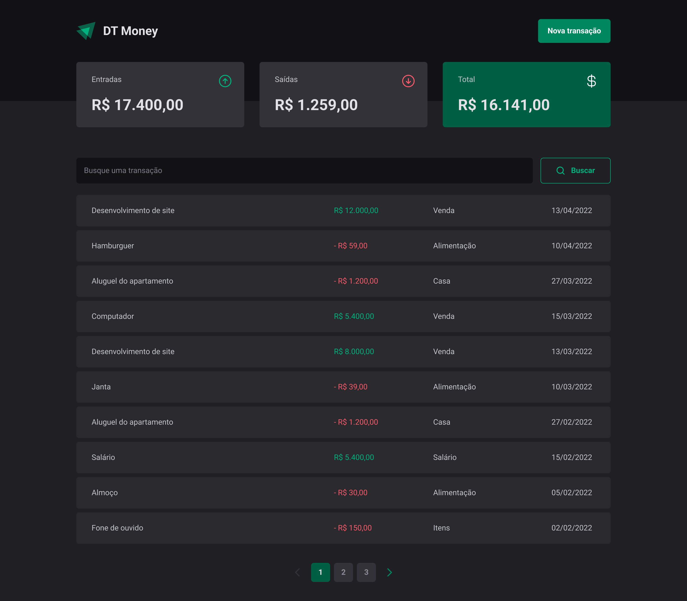
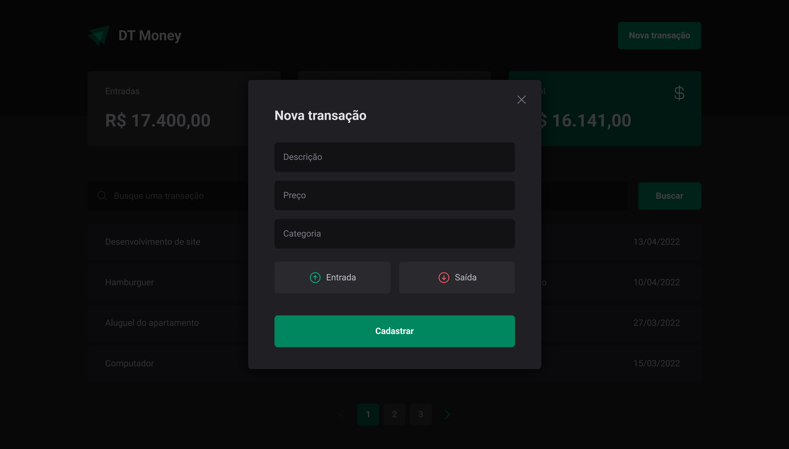

<div align="center">
  
</div>

## 💻 O que é o DT Money?

O DT money é uma aplicação simples de controle financeiro, onde você pode cadastrar suas entradas e saídas, e ver o saldo total.
Além disso, você pode gerenciar suas transações, em categorias, o que facilita a visualização do seu dinheiro.

## 📷 Demonstração

<div align="center">
  
  
</div>

## 🚀 Tecnologias

✔️ [React](https://reactjs.org/) <br/>
✔️ [TypeScript](https://www.typescriptlang.org/)<br/>
✔️ [Styled Components](https://styled-components.com/)<br/>
✔️ [Context API](https://pt-br.reactjs.org/docs/context.html)<br/>
✔️ [React Hook Form](https://react-hook-form.com/)<br/>
✔️ [React Router DOM](https://reactrouter.com/web/guides/quick-start)<br/>
✔️ [Zod](https://zod.dev/)<br/>
✔️ [Axios](https://axios-http.com/docs/interceptors)<br/>

## 📦 Como baixar o projeto

```bash
    # Clonar o repositório
    $ git clone

    # Entrar no diretório
    $ cd ignite-dt-money

    # Instalar as dependências
    $ yarn ou npm install

    # Iniciar o projeto
    $ yarn start ou npm run start

```

## 🖊️ Autor

- [@raniellimontagna](https://www.github.com/raniellimontagna)
